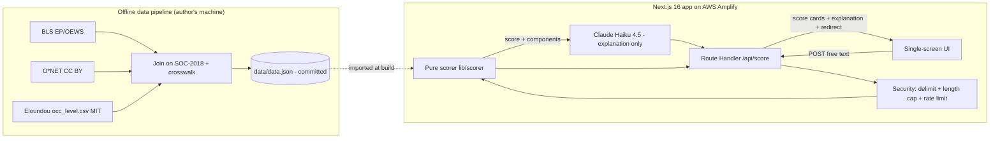
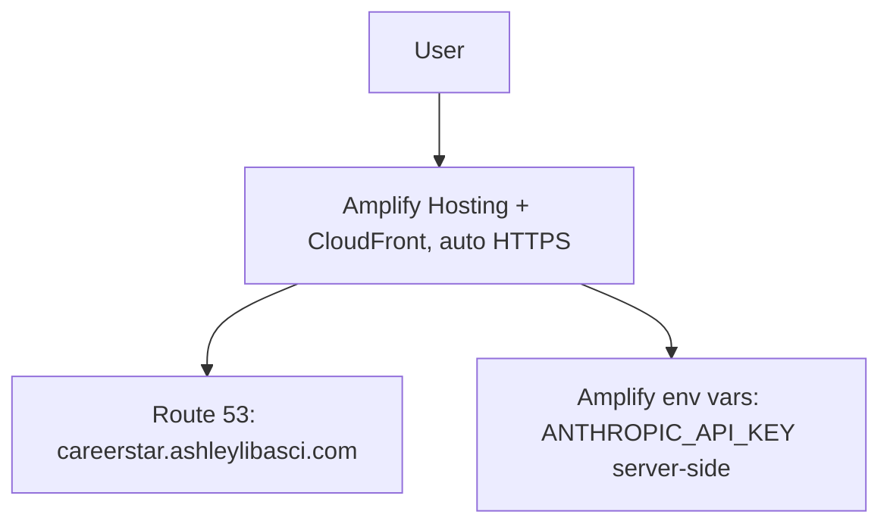

# CareerStar — Architecture Spine

**Paradigm:** a single full-stack **Next.js 16 (App Router)** application, **TypeScript end-to-end**, with server-side **Route Handlers** as the only backend. **Stateless**, no database. A **deterministic scorer** over a **committed static dataset** is the source of truth; an LLM only explains its output. Deployed on **AWS Amplify Hosting**.

The whole system is: an **offline data pipeline** (run on the author's machine) that produces a committed `data.json`, and a **runtime app** that reads it. These two never mix.

## Invariants (Architecture Decisions)

Each AD fixes a call that units one level down could otherwise make incompatibly.

**AD-1 — One app, one language.** `[ADOPTED]`
- **Binds:** all UI + backend logic live in one Next.js 16 App-Router project, TypeScript only; backend logic is Route Handlers (`app/api/*/route.ts`).
- **Prevents:** a second runtime/service and its ops surface (CORS, inter-service auth, second deploy) with no functional payoff.
- **Rule:** no separate scoring service unless scoring grows to genuinely need pandas/ML; revisit only then.

**AD-2 — The scorer is one pure module; the UI only renders.**
- **Binds:** all scoring math lives in a single server-side module (`lib/scorer`), pure and deterministic (same input → same output). UI components receive scorer output and render it; they never compute a score or a component.
- **Prevents:** two sources of truth for the score drifting apart.
- **Rule:** if a number appears in the UI, it came from the scorer module, unmodified.

**AD-3 — Data is joined offline, read at runtime.**
- **Binds:** a build-time/offline pipeline (`scripts/` or `pipeline/`) joins BLS + O*NET + Eloundou on **SOC-2018** codes (via the O*NET-SOC ↔ SOC crosswalk) and emits a single committed artifact (`data/data.json`). The runtime app only imports/reads that artifact.
- **Prevents:** joining or fetching source datasets inside a request (slow, fragile, non-reproducible).
- **Rule:** no dataset join, crosswalk, or external data fetch in any Route Handler. Refresh = re-run the pipeline, re-commit `data.json`.

**AD-4 — The LLM explains; it never decides.**
- **Binds:** the score and all component sub-scores come from the scorer (AD-2). The LLM (Claude **Haiku 4.5**, `claude-haiku-4-5`) is called server-side with the *already-computed* score + components + cited data, and returns only the plain-English explanation and redirect rationale.
- **Prevents:** the "thin wrapper" failure — LLM output being mistaken for the verdict.
- **Rule:** no code path lets the LLM produce or alter a numeric score.

**AD-5 — Free-text is data, not instructions (the security boundary).**
- **Binds:** instructions live in the system prompt; untrusted user free-text is wrapped in a clearly delimited data block and declared as data. Enforce a server-side input length cap and per-IP/session rate limiting on any LLM-backed route. API keys/secrets are server-side only (env var; never `NEXT_PUBLIC_*`, never in client bundles or the repo).
- **Prevents:** prompt injection, cost/abuse attacks, credential leakage.
- **Rule:** any endpoint that touches user text or the LLM enforces all four (delimited data, length cap, rate limit, server-only secret) — no exceptions.

**AD-6 — Stateless.**
- **Binds:** no accounts, no database, no persistence of user input beyond the request lifecycle.
- **Prevents:** data-governance and auth surface the MVP doesn't need.
- **Rule:** if a feature needs to persist user data, it is out of MVP scope (see PRD §9).

**AD-7 — Deploy on AWS Amplify Hosting.** `[ADOPTED]`
- **Binds:** hosting is AWS Amplify Hosting (native Next.js SSR on Lambda+CloudFront); custom domain via **Route 53** with Amplify-provisioned HTTPS; secrets as Amplify environment variables. App at a subdomain/path off `ashleylibasci.com` (root stays the personal portfolio).
- **Prevents:** ops sprawl (EC2 patching/TLS) and insecure config.
- **Rule:** deploy target is Amplify; no hand-rolled server unless a hard requirement forces it.

## Seed (true at cold-start; owned by the code once it exists)

- **Stack:** Next.js 16.2.x (App Router, Turbopack, Node 20+), TypeScript, React 19.2. Scaffold with `create-next-app@latest`.
- **LLM SDK:** `@anthropic-ai/sdk` (server-side), model `claude-haiku-4-5` (swap to `claude-sonnet-5` if richer prose is wanted).
- **Repo shape:**
  - `app/` — UI + Route Handlers (the single screen + `app/api/score/route.ts`)
  - `lib/scorer/` — pure deterministic scoring module (AD-2)
  - `data/data.json` — committed static artifact (AD-3 output)
  - `scripts/pipeline/` — offline data join/crosswalk that produces `data/data.json`
  - `lib/security/` — input validation, rate limiting, prompt assembly (AD-5)

## Diagrams

## Deferred (owned downstream, not fixed here)

- Exact **weighting scheme** and the **volatility proxy** formula (PRD FR2.2/FR2.5) — owned by the scorer code, documented in the methodology page.
- Exact **viability threshold** that triggers a redirect (PRD FR3.3).
- **Free-text → occupation** parsing approach (rules vs. LLM-assisted mapping) — a scorer/input-module concern; whichever, it obeys AD-4 (no scoring) and AD-5 (treated as data).
- **UI/visual design** of the score cards and redirect (a light UX concern).
- **Product name** (working title "CareerStar").

## Open questions

- Confirm Amplify's current Next.js 16.2 support level at build time; if it lags, fallback is OpenNext/SST (still AWS) — does not change any AD.
- Rate-limit store for a stateless app (in-memory per-instance vs. a lightweight managed store) — decide during build; AD-5 holds regardless.
